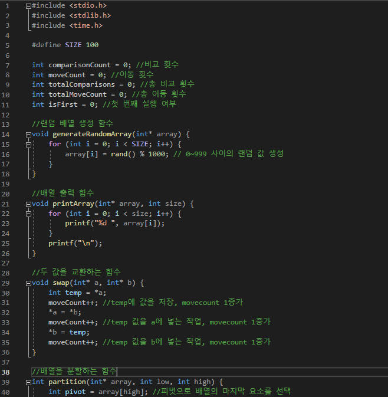
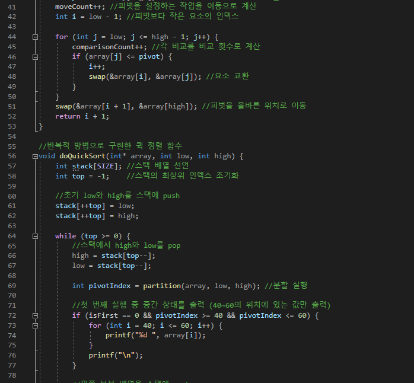
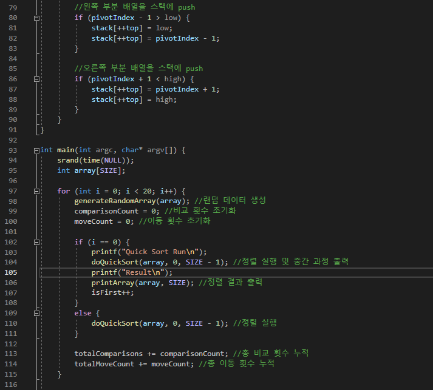
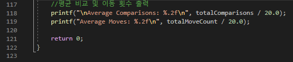
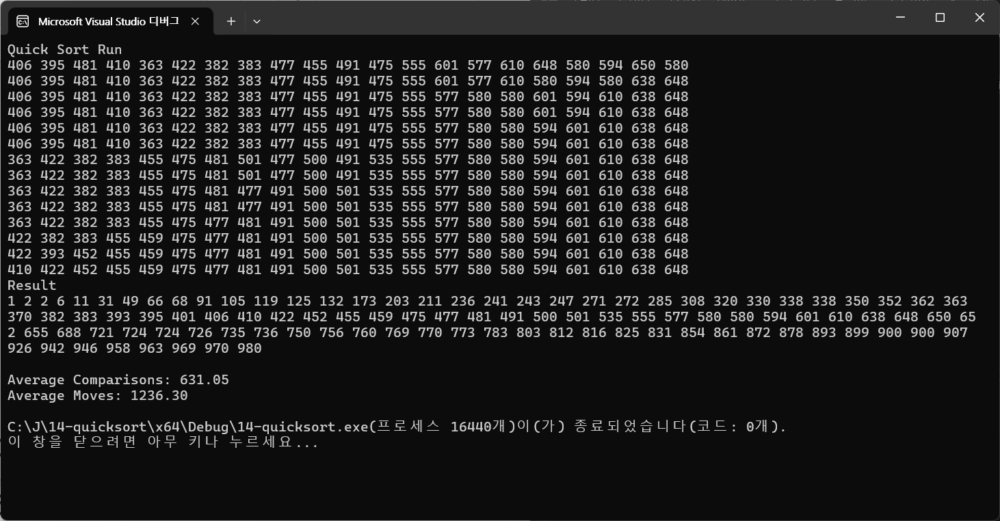

# Quicksort
선택정렬 : 배열을 순회하면서 가장 작거나 가장 큰 요소를 선택하고, 해당 요소를 현재 위치와 교환하는 정렬로 이 과정을 계속해서 반복한다. 
=> 시간복잡도는 최악의 경우 : O(n^2), 평균의 경우 : O(n^2), 최선의 경우 : O(n^2) 비교 횟수는 항상 n(n-1)/2로 고정되며 데이터의 초기 상태에 영향을 받지 않는다. 이동 횟수는 3(n-1)이다.
! 안정성을 만족하지 않는다. 간단하지만 비효율적이고, 작은 데이터셋에서만 적합하며, 크기가 큰 배열에서는 비효율적이다. 데이터가 거의 정렬된 경우에도 성능이 개선되지 않는다.

삽입정렬 : 배열을 정렬된 부분과 정렬되지 않은 부분으로 나누고, 정렬되지 않은 부분의 요소를 하나씩 정렬된 부분에 삽입한다.
=> 시간복잡도는 최악의 경우 : O(n^2), 평균의 경우 : O(n^2), 최선의 경우 : O(n)로 최악의 경우는 역순으로 정렬된 경우를 의미하며, 모든 단계에서 앞에 놓인 자료를 전부 이동해야한다. 최선의 경우는 이미 정렬된 경우로 비교만 수행하는 경우를 의미한다.
! 안정된 정렬방법이다. 데이터가 거의 정렬된 경우 매우 효율적이고, 큰 데이터셋은 많은 이동이 필요하므로 작은 데이터셋에 적합하다. 

버블정렬 : 인접한 두 요소를 비교하여 큰 값을 뒤로 보내는 방식이다. 한번 실행되고 나면 가장 큰 값이 배열 끝으로 이동하게 된다.
=> 시간복잡도는 최악의 경우 : O(n^2), 평균의 경우 : O(n^2), 최선의 경우 : O(n^2)로 최악의 경우는 완전히 역순으로 정렬된 경우(이동횟수 = 3 * 비교횟수)를 의미하며, 최선의 경우는 이미 정렬된 경우(이동 횟수 = 0)로 비교만 수행하는 경우를 의미한다.
! 단순하지만 매우 비효율적이기 때문에 성능이 좋지않다. 레코드 이동 과다(이동연산은 비교연산보다 더 많은 시간이 소요된다.)

쉘정렬   : 삽입 정렬이 어느 정도 정렬된 리스트에서 대단히 빠른 것에서 착안된 형태로, 삽입 정렬은 요소들이 이웃한 위치로만 이동하므로, 많은 이동에 의해서만 요소가 제자리를 찾아간다. 요소들이 멀리 떨어진 위치로 이동할 수 있게 하면 보다 적게 이동하여 제자리를 찾을 수 있다. 전체 리스트를 일정 '간격'의 부분리스트로 나누고, 나누어진 각각의 부분 리스트를 삽입정렬로 하게 된다.
=> 시간복잡도는 최악의 경우 : O(n^2), 평균의 경우 : O(n^(3/2), 최선의 경우 : O(nlogn)인데 간격 선택 방법에 따라 달라진다. 최선의 경우는간격이 효율적으로 선택된 경우이다.
! 안정성을 만족하지 않는다. 불연속적인 부분리스트에서 원거리 자료 이동으로 보다 적은 위치교환으로 제자리 찾을 가능성이 증대된다는 것과 부분리스트가 점진적으로 정렬된 상태가 되므로 삽입정렬 속도가 증가한다는 장점이 있다.

합병정렬 : 리스트를 두 개의 균등한 크기로 분할하고 분할된 부분리스트로 정렬하는 방식으로, 정렬된 두 개의 부분리스트를 합하여 전체 리스트를 정렬한다.
=> 시간복잡도는 최악의 경우 : O(nlogn), 평균의 경우 : O(nlogn), 최선의 경우 : O(nlogn)로 큰 차이가 없다. 비교 횟수는 크기 n인 리스트를 정확히 균등 분배하므로 logn개의 패스, 각 패스에서 리스트의 모든 레코드 n개를 비교하므로 n번의 비교 연산을 수행해야한다.
! 안정적이며 데이터의 초기 분산 순서에 영향을 덜 받는다. 레코드의 크기가 큰 경우에는 매우 큰 시간적 낭비를 초래하고, 레코드를 연결리스트로 구성하여 합병정렬할 경우, 매우 효율적이다. 

