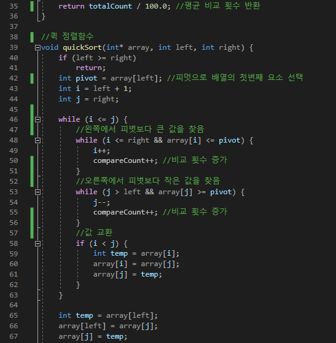
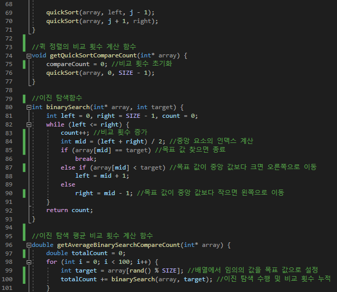
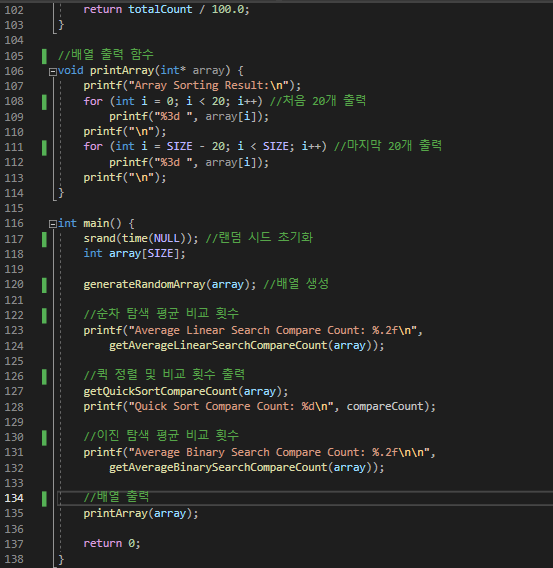
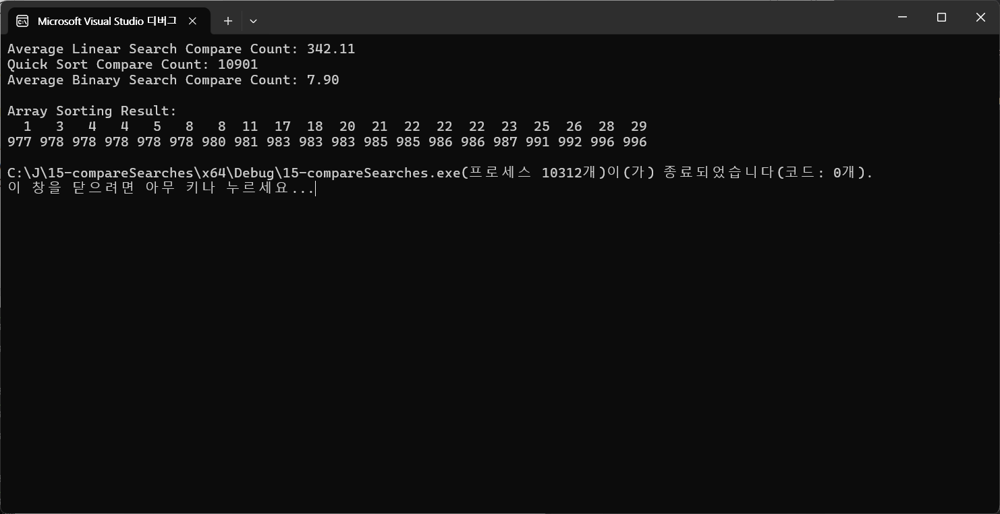

# Compare Searches {Result Image}
A : 첫번째부터 마지막까지 차례대로 값을 비교하며 목표 값을 찾는다. 그렇기 때문에 목표 값이 배열의 초반부분에 있으면 적은 비교로 찾을 수 있지만, 후반부분에 위치하거나 없을 경우에 배열 전체를 탐색해야하기 때문에 비교 횟수가 커지게된다. 비교 횟수는 평균적으로 배열 크기의 절반에 가깝다. 정렬되지않은 배열에서 순차 탐색은 최선의 경우 O(1), 평균과 최악의 경우 O(n)의 시간 복잡도를 가진다.

B : 재귀적으로 배열을 분할하여 피벗을 기준으로 왼쪽과 오른쪽의 값을 정렬한다. 평균 비교 횟수는 O(nlog n)이다. 최악의 경우 O(n^2)이지만, 랜덤 피벗 선택을 통해 대부분 평균적인 성능을 나타낸다. 퀵 정렬을 통해 데이터가 정렬되면 탐색의 효율성이 크게 증가한다.

C : 중간 값을 기준으로 목표 값이 왼쪽에 있는지, 오른쪽에 있는지를 판단하여 탐색 범위를 반으로 줄여간다. 평균 비교 횟수는 O(log n)으로, 탐색 대상이 절반씩 줄어들기 때문에 비교 횟수가 매우 작다. 탐색 시간 면에서 순차 탐색보다 훨씬 효율적이다.

=> 정렬되지 않은 배열에서는 순차 탐색이 모든 데이터를 하나씩 확인해야하지만, 졍렬된 배열에서는 이진 탐색이 탐색 범위를 효율적으로 줄일 수 있다. 순차 탐색의 평균 시간 복잡도는 O(n), 이진 탐색의 평균 시간 복잡도는 O(log n)이다. 배열 크기가 커질수록 차이가 커진다. 퀵 정렬에 한번 소요된 O(nlog n)의 비용이 탐색 효율을 극대화해 이후 반복되는 탐색에서 시간절약이 된다.

