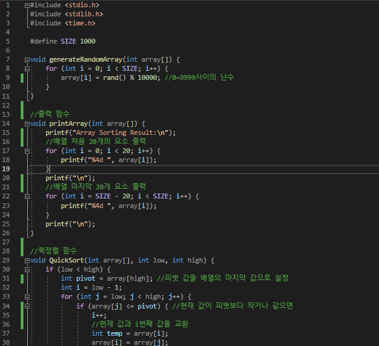

# Interpolation Search {Result Image}

Binary Search는 정렬된 배열의 중앙에 있는 값을 조사하여 찾고자 하는 항목이 왼쪽 또는 오른쪽 부분 배열에 있는지를 알아내어 탐색의 범위를 반으로 줄여가며 탐색하는 방식이다. 탐색 범위는 매번 절반으로 줄어들기 때문에, 최악의 경우 시간 복잡도는 O(log n)이다. 하지만 Binary Search는 배열의 값이 고르게 분포되어 있는지 여부를 고려하지 않습니다. 탐색 과정에서 타겟 값이 실제로 배열의 중간에 가까운지와는 상관없이 탐색범위를 나눈다.
Interpolation Search는 타겟 값이 배열 내에서 어느 위치에 있을 가능성이 높은지를 고려하여 탐색 범위 내 값의 분포를 기반으로 보간 위치를 계산하여 타겟 값이 있을 가능성이 높은 위치를 예측한다. 탐색키가 존재할 위치를 예측하여 탐색하는 방법이고 시간 복잡도는 O(log n)이다. Binary Search와 유사하나 리스트를 불균등 분할하여 탐색한다. 

=> 둘을 비교하면 
1. 중간 값 선택 기준은 Binary Search : 항상 탐색 범위의 정중앙, Interpolation Search : 타겟 값이 있을 가능성이 높은 위치를 계산한다.
2. 값의 분포 고려 여부는 Binary Search : 고려X, Interpolation Search : 분포를 고려하여 위치를 예측한다.
3. 효율성은 Binary Search : 모든 배열에서 일정한 성능 제공하고, Interpolation Search : 값이 균등 분포일 때 뛰어난 성능을 제공한다.

결론 : 배열 내 값이 대략적으로 균등하게 분포되어 있다면 보간 위치 계산은 타겟 값의 실제 위치에 매우 근접하기 때문에 한번의 계산으로 탐색범위를 Binary Search보다 훨씬 빠르게 좁힐 수 있다. 또, 배열 내 값이 중앙에 몰려 있지 않을 때 Binary Search는 중간을 기준으로 탐색하기 때문에 타겟 값이 배열의 끝부분에 있는 경우 많은 단계를 거쳐야하지만 Interpolation Search는 타겟 값이 어느 위치에 있을 가능성이 높은지 고려하여 보간 위치를 계산하므로 탐색 단계를 크게 줄일 수 있다.

