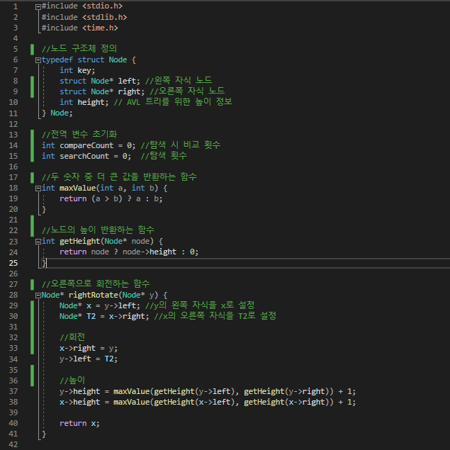
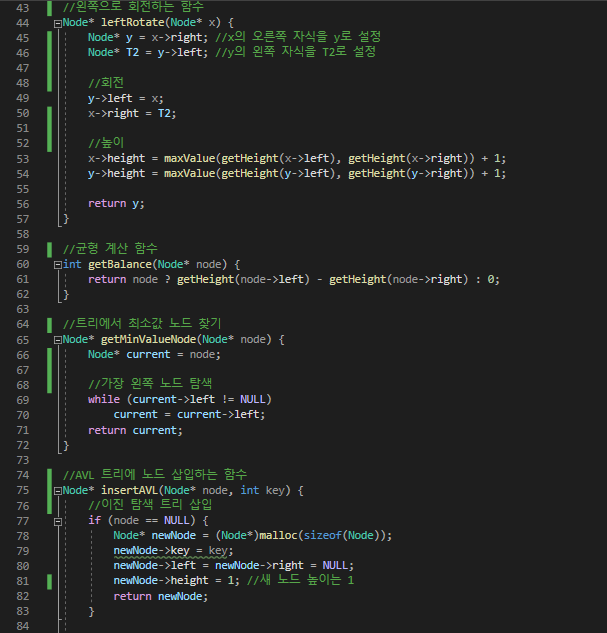
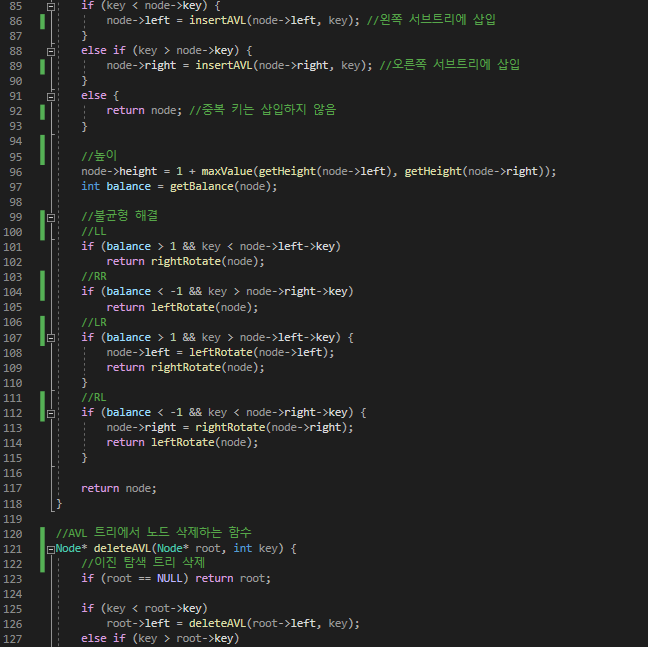
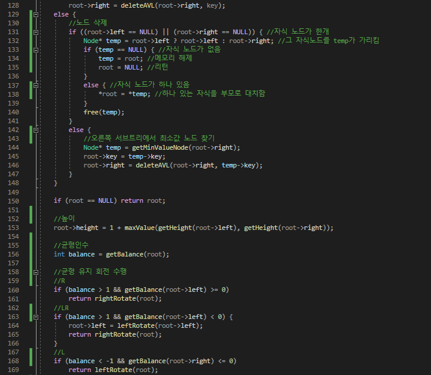
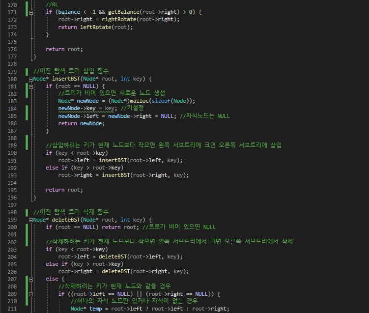
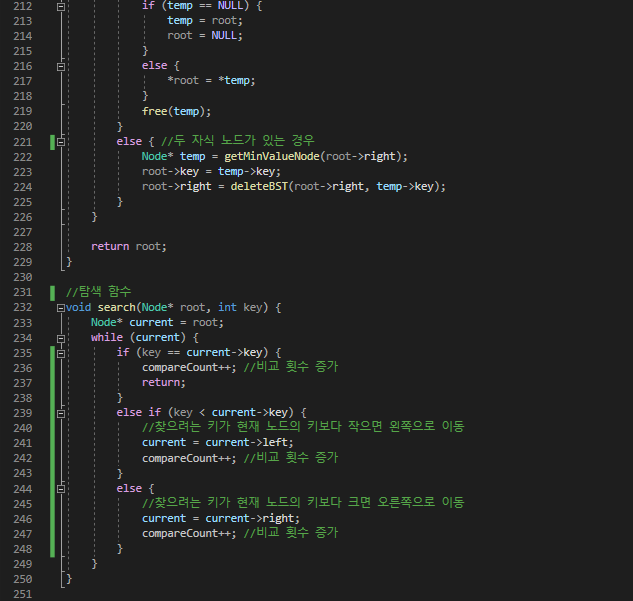
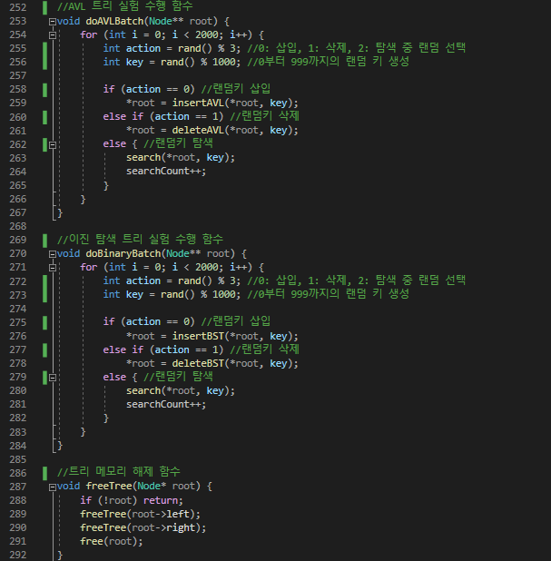
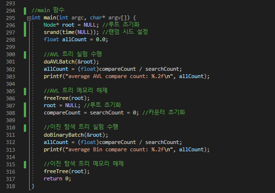
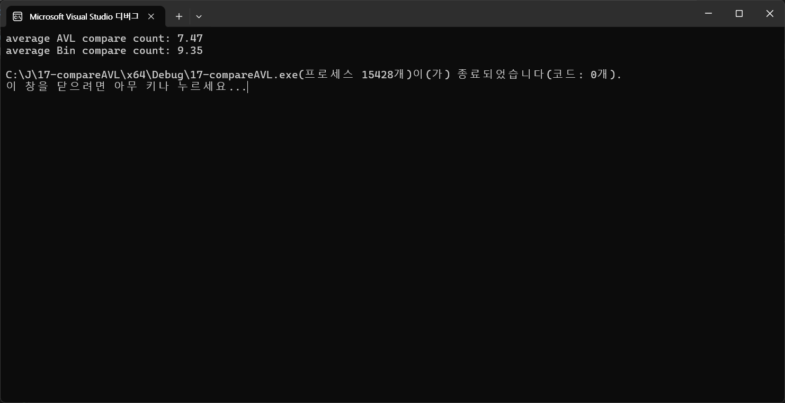
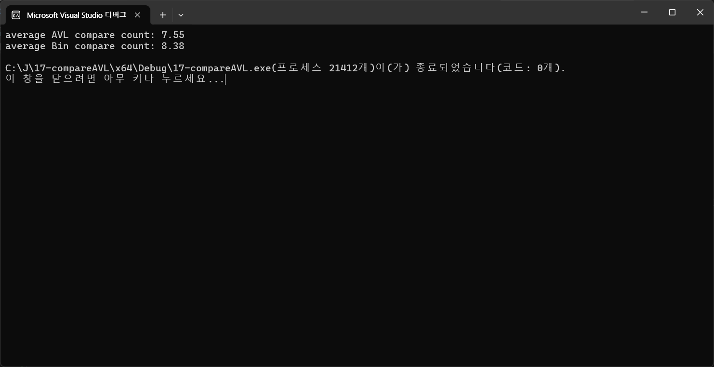

# Compare AVL {Result Image}

이진 탐색 트리 : 노드 삽입 시 특정 규칙에 따라 노드를 배치하지만, 트리의 균형은 유지하지 않는다. 최악의 경우 트리가 편향되어 연결 리스트와 같은 구조가 되어 탐색 시간이 선형(O(n))이 될 수 있다. 삽입, 삭제 시 균형을 유지하지 않기 때문에 탐색 시 특정 키를 찾기 위해 더 많은 비교가 필요할 수 있다. 최악의 경우 비교 횟수가 n에 가깝다. 
AVL 트리 : 스스로 균형을 유지하는 트리이기 떄문에 삽입, 삭제 후 트리의 균형 인수를 확인하여 필요하면 회전을 수행한다. 따라서 AVL 트리는 항상 균형을 유지하며, 탐색 시간이 O(log n)으로 보장된다. 삽입 후 균형을 유지하기 위해 회전을 수행하고, 삭제 후에도 균형을 유지한다. 또, 탐색 단계를 거칠 때 탐색 과정에서 비교 횟수를 누적한다. 탐색 시 트리가 균형을 유지하기 때문에 특정 키를 탐색할 때 비교해야하는 노드 수가 적다. 
=> AVL 트리의 평균 비교 횟수가 이진 탐색 트리의 평균 비교 횟수보다 훨씬 작다.
=> AVL 트리는 항상 균형을 유지하므로 탐색 경로의 길이가 더 짧기 때문이다.
=> AVL 트리는 항상 O(log n)의 복잡도를 보장하며, 탐색이 더 효율적이다.
=> 이진 탐색 트리가 최악의 경우(균형을 완전히 잃은 경우) 복잡도가 O(n)까지 증가할 수 있다.
=> 따라서 탐색 연산이 빈번할 경우 AVL 트리가 더 적합하다.
=> 실제 코드 결과로 증명!

